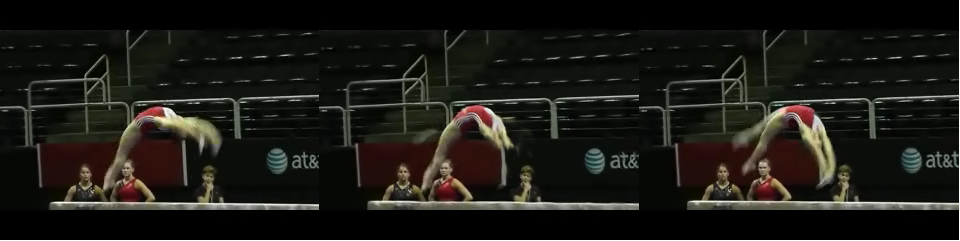
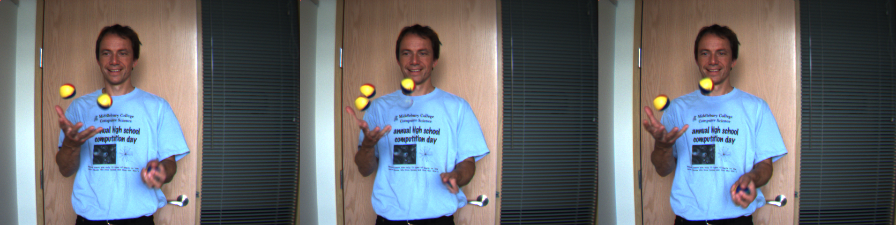
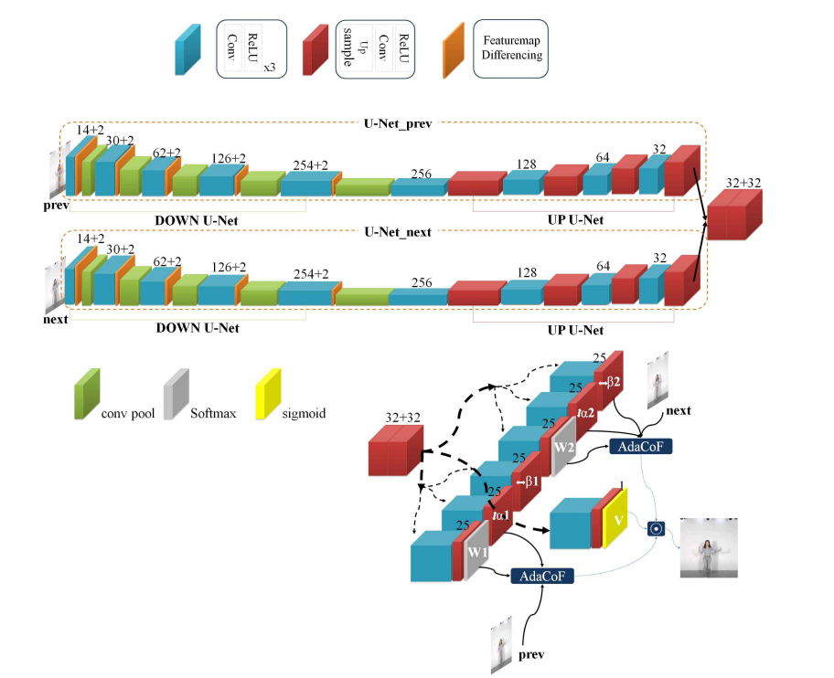
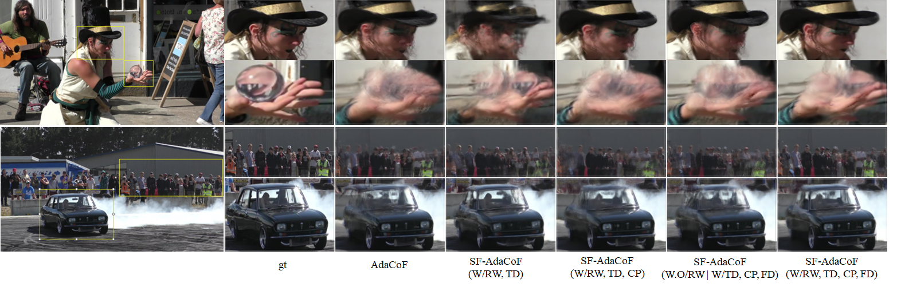
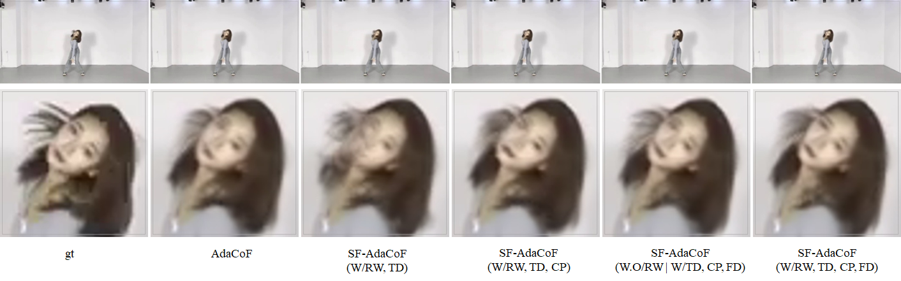
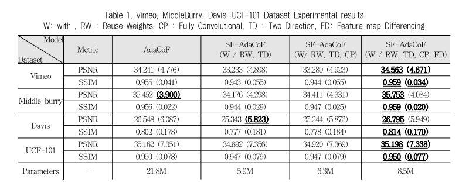

<h1 align = "center"> Simaese Feature map - AdaCoF </h1>

<h1 align="center"> VideoFrameInterpolation </h1>

<h3 align="center"> Capstone Project  (2022-09 ~ 2023-09) </h3>

<br/><br/>
`VideoFrameInterpolation` **is the Image interpolation is the process of estimating new pixel values in an image based on the values of surrounding pixels.
We want to perform this image interpolation using computer vision techniques.**

**We build a new model(SF-AdaCoF) based on the existing video frame interpolation model "AdaCoF: Adaptive Collaboration of Flows for Video Frame Interpolation".**
`We propose a video frame interpolation model expects to improve performance and reduces parameters with the new model.`

비디오 프레임 보간은 이전 이후 프레임을 이용하여 가운데 프레임을 추정하는 작업입니다.
우리는 컴퓨터 비전 기술을 이용하여 이를 수행하였습니다.

**우리는 기존 "AdaCoF: Adaptive Collaboration of Flows for Video Frame Interpolation"을 기반으로 하여 새로운 Simaese Feature map - AdaCoF를 제작하였습니다.**

<p float="center">
  
  
</p>

The video file on the left was extracted from YouTube and changed to 12 FPS. We then used our model to interpolate the images to create the right video file at 48 FPS.

As you can see, the right video is much smoother and looks quite natural.

위에 보이는 gif파일은 왼쪽은 유튜브 영상에서 12FPS로 추출한 영상이고 오른쪽은 왼쪽 영상을 이용해 48FPS로 제작한 영상입니다.
오른쪽의 영상이 더욱 부드러운 것을 확인할 수 있습니다.





The photo above shows an image from an earlier point in time, an interpolated image, and an image from a later point in time. The interpolated image is created from the images from the earlier and later viewpoints.
위에 이미지는 이전 시점, 가운데 시점, 이후 시점의 프레임입니다. 가운데 이미지는 양 옆의 이미지로부터 생성되었습니다.


<h2> Project Files Description </h2>

<h3>Directories</h3>
<ul>
  <br/>
  <li><b> vimeo folder </b> - Inside the dancing folder, there are folders of models(AdaCoF, SF_AdaCoF_CP, SF_AdaCoF_RWTD, SF_AdaCoF_RWTDCP, SF_AdaCoF_noShare, SF_AdaCoF) trained with vimeo data, each trained in a different way.
  And inside each model folder, we have the model folder, train.py, and trainer.py needed to train the model, and we have the model trained to 50 epochs and 60 epochs. SF_AdaCoF is our final model.

<br/>
  <li><b>interpolate_img folder</b> - This is the folder that contains the before and after images for each model.</li>

<br/>
  <li><b>interpolate_video folder</b> - This is the folder that contains the before and after videos for each model.</li>

</ul>


<h3>Executable Files</h3>
<ul>
  <br/>
  <li><b> interpolate_image.py </b> - A pyfile that runs image interpolation after specifying a particular model.
<br/><br/>

  <li><b> interpolate_video.py </b> - A pyfile that runs video interpolation after specifying a particular model.</li>
<br/>
  <li><b> (New) interpolate_inference.py </b> - A pyfile that runs folder or video or Youtube URL interpolation after specifying a particular model. you can choose various option from config.yaml for interpolation. If you want to inference this code, I recommend you use this. </li>
<br/>
  <li><b> evaluation.py </b> - A pyfile that calculates the PSNR, SSIM score of a model by specifying a specific model and dataset.</li>

<br/>
  <li><b> MakeTripletset.py </b> - A pyfile that builds images into tripletsets at specific intervals.</li>

<br/>
  <li><b> interpolate.sh </b> - A file that contains some example to start this process </li>


<br/><br/>


<br/>


# Model Pipeline
-   **The pipeline of our final proposed model is** **SF-AdaCoF**<br/><br/>


**The main techniques of the model are described below.**

**1. Progress in two directions**<br/>
**2. Models that can inject Featuremap differencing information**<br/>
**3. Gradient sharing**

<br/>

**SF-AdaCoF**의 핵심 기술은 다음과 같습니다.

**1. 이전 이후 이미지가 각각의 처리를 거칩니다.**<br/>

**2. 이전 이후 이미지는 U-NET 구조를 거치며 featuremap differencing을 통해 서로 정보를 주고 받습니다.**<br/>

**3. 각 U-Net의 Encoder부분에서는 가중치를 공유합니다.**


# Model Evaluation
-   Below is a table of results from evaluating the different models we devised on different datasets.

아래는 다양한 데이터 셋으로 우리의 모델을 평가한 그림입니다.





And we show **SF-AdaCoF** evaluation with various datasets.

그리고 **SF-AdaCoF**의 다양한 실험결과를 보여드립니다.


<h5>We found that our method produced a model with better performance and less computation than the original Adacof model!</h5>


# Model Inference

### Environment
**Python = 3.8**<br/>
**Cuda = 11.3**
<br/>

```
conda create -n "SF_AdaCoF" python=3.8 -y
conda activate SF_AdaCoF
conda install pytorch==1.11.0 torchvision==0.12.0 torchaudio==0.11.0 cudatoolkit=11.3 -c pytorch
pip install opencv-python
pip install cupy-cuda113
```

The rest modules that you have to install are looked at **environment.yml**.

### Inference
If you want to excute the process, follow this code. And you have to amend the condfig.yaml
<br/>

```
interpolate_inference.py --repeat [int : count]    # png파일이 들어있는 폴더를 보간하고 싶을 경우 

python interpolate_inference.py --mp4_own [video path] --repeat [int:count]  # 소유한 영상을 보간하고 싶을 경우

python interpolate_inference.py --frame [Subtract FPS] --url_path [Youtube Link] --repeat [int:count]  # Youtube url을 가지고 해당 영상을 보간하고 싶을 경우 frame 유튜브 영상을 몇 frame으로 가져오고 싶은지 25이하 설정 권장

```

**repeat** means that how many interpolate you want? if you input 1 you can get twice frames or 2 you can get quintuple frames.


### Evaluation
If you want to verify our result that you can use it. And you have to amend the condfig.yaml
<br/>

```
evaluation.py --model_dir [Model_name] --want_data [Dataset_Name]
```
You can check the result in **test_log.txt**.

### Make Datasets

  Additionaly we made a Triplet Youtube datasets for testing big difference between prev iamge and next image. We collect data from Youtube video that is K-POP Dancing. 
<br/>

```
MakeTripletset.py --video_url [LINK] --name [Youtube Video Title] --start [Extract start frame] --end [Extract end frame] --interval [Interval]
```


<h2> Paper References</h2>
<ul>
  <li><p>	CVPR 2020 Computer Vision and Pattern Recognition (cs.CV)	arXiv:1907.10244 [cs.CV], 'AdaCoF: Adaptive Collaboration of Flows for Video Frame Interpolation' [Online].</p>
      <p>Available: https://arxiv.org/abs/1907.10244</p>
  </li>

</ul>

<h2> Code References</h2>
<ul>
  <li><p>	HyeongminLEE
, 'AdaCoF-pytorch' [Online].</p>
      <p>Available: https://github.com/HyeongminLEE/AdaCoF-pytorch</p>
  </li>

</ul>


<h2> Dataset References</h2>
<ul>
  <li><p>Korea Intelligent and Information Society Agency, 'K-pop choreography video' [Online].</p>
      <p>Available: https://aihub.or.kr/aihubdata/data/view.do?currMenu=115&topMenu=100&dataSetSn=52</p>
  </li>
  <li><p>IJCV 2019
Video Enhancement with Task-Oriented Flow, 'Vimeo Triplet dataset (for temporal frame interpolation)'. [Online].</p>
      <p>Available: http://toflow.csail.mit.edu/</p>
  </li>
</ul>


