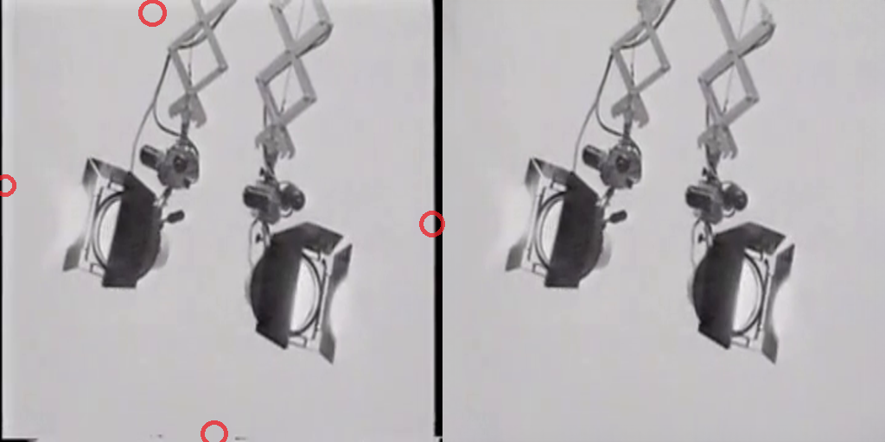
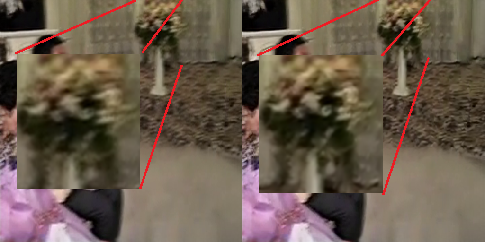
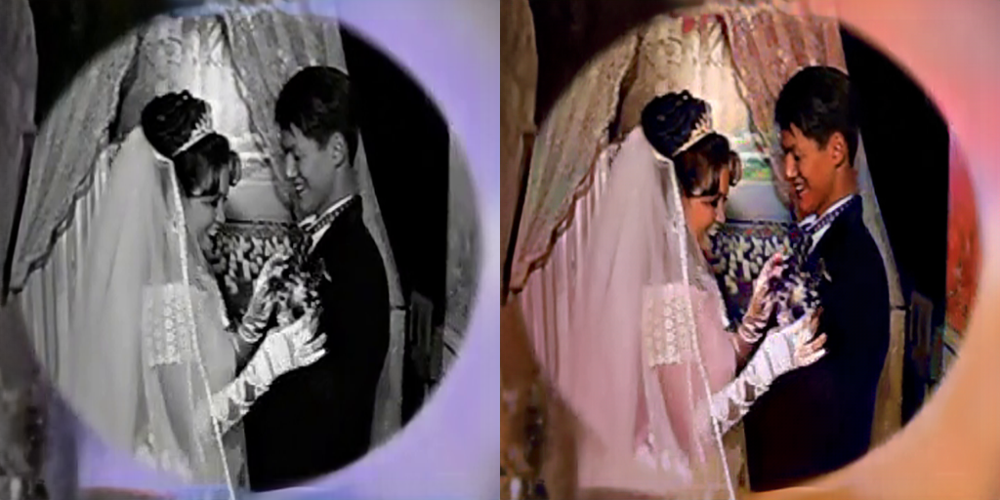
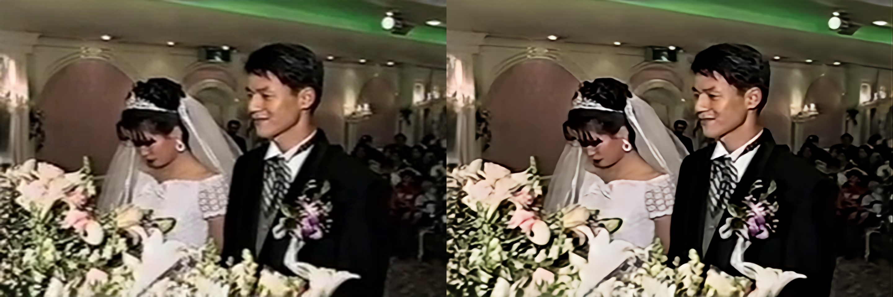
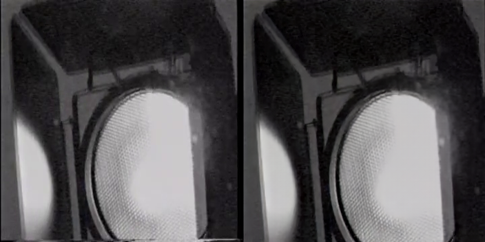
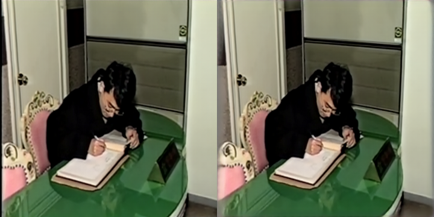
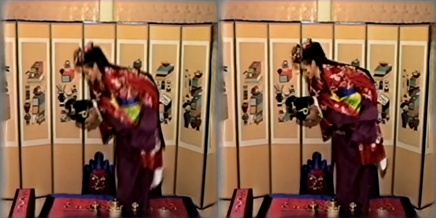
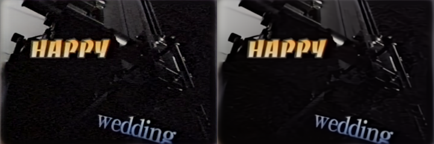
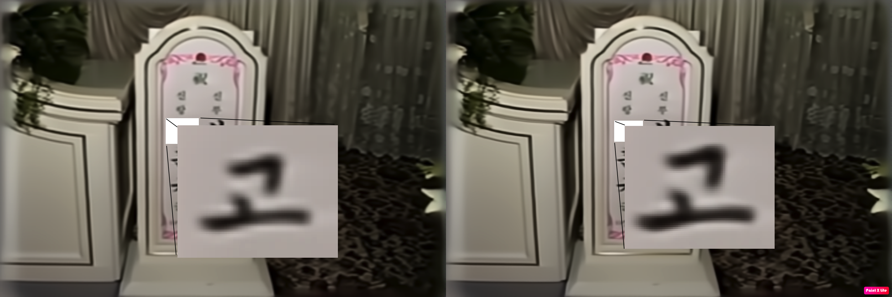

<div align="center">

# <span style="color: #ff953e"> Restoration Antique Movie

**Project Duration [ 2023.11 ~ 2023.12 ]**

### The project is produced in two version.

#### First one is consisted of image process AI technique and second one is consisted of video process AI technique.
#### If you want to change your image, I recommend that you should use [first one](##**Objective**) or if you want to handle video, I suggest that you should use [second one](#revision-project).


</div>


<div align="center">

## <span style="color: #ff953e"> **Objective**


**옛날 영상을 고품질의 영상으로 변환한다**

**Convert old footage into high-quality video**
  
  **부모님 결혼식 영상을 현대화하여 선물하기**
  
**Modernize and gift your parents' wedding video**

</div>


<div align="center">


## <span style="color: #ff953e"> **Contribution**

</div>

- 사실 어머니의 생신을 맞이하여 한 프로젝트이기에, 부모님이 좋아하실 것으로 예상된다.
  
  I actually did this project for my mom's birthday, so I know she'll love it.
  
- 옛날 영상의 복원 프로세스를 하나의 프로세스로 통합함으로써 다른 저품질의 영상도 쉽게 고품질의 영상으로 복원 가능하다.

    By consolidating the process of restoring old footage into one process, you can easily restore other low-quality footage to high quality.

- Video Frame Interpolation의 경우, 직접 만든 Model로 이를 사용함으로써 성취감을 키운다.

    For Video Frame Interpolation, you get a sense of accomplishment by using it with your own model.


<div align="center">

## <span style="color: #ff953e"> **Process**

</div>
각 기술들의 간단한 원리와 출처를 적을 예정입니다.

I'll write down the simple principles and sources for each technique.

총 5가지의 기술을 이용하여 이미지를 제작할 예정이며 사용할 기술들은 다음과 같다.

We'll be using a total of five different techniques to create the image, and they are as follows

**1.** **Image Inpainting**을 통하여 기존 비디오에 있던 불완전한 영역을 자연스러운 영역으로 교체한다. 예를 들어, 시간 표시로 가려져 있는 영역 혹은 외곽 끝 부분의 부자연스러운 영역들을 제거하고 자연스러운 부분으로 교체 진행
  
**2.** **Image Deblurring**을 이용하여 옛날 카메라 기술의 부족으로 생긴 Blur한 Frame을 자연스럽게 처리해준다.

**3.** **Image Colorization**을 이용하여 흑백으로 표현되어 있던 Frame을 색감 처리를 진행한다.

**4.** **Super Resolution**을 이용하여 기존 화질 360X240의 영상에서 1280X720의 영상으로 교체한다.

**5.** **Video Frame Interpolation**을 이용하여 기존 FPS 25 => FPS 50의 영상으로 제작한다.


<div align="center">

### <span style="color: #ff953e"> **Tech**

#### [Image Inpainting](https://github.com/fenglinglwb/MAT)
##### MAT: Mask-Aware Transformer for Large Hole Image Inpainting

#### [Image Deblurring](https://github.com/ZhendongWang6/Uformer)
##### Uformer: A General U-Shaped Transformer for Image Restoration

#### [Image Colorization](https://github.com/piddnad/DDColor)
##### DDColor: Towards Photo-Realistic Image Colorization via Dual Decoders

#### [Super Resolution](https://github.com/XPixelGroup/DiffBIR)
##### DiffBIR: Towards Blind Image Restoration with Generative Diffusion Prior

#### [Video Frame Interpolation](https://github.com/Go-MinSeong/VFI-with-AdaCoF)
##### SF-AdaCoF: Siamese Frane AdaCoF for Kernel based Video Frame Interpolation
</div>


<div align="center">

## <span style="color: #ff953e"> **Result**

</div>

In this part, I'll show you the result of each process.
The result image consists of a before(Left) and after(Right) image.

### <span style="color: #fff5b1"> **Image Inpainting**



- Left image is original images the other one is inpainted image. I use inpainting technique for fill in the ends of the four sides. For instance, you can see blur region and black region in left image. But there is not a awkward region anywhere in right one. 
- I set a mask image that has 20pixel mask section every side. The inpainting model predicted the section naturally. 

### <span style="color: #fff5b1"> **Image Deblurring**



- Left image is original images the other one is deblurred image. I guess that My parents wedding video was shot by one person walking around. So for most images, the blurring exists. To solve this problem,  I utilize deblurring technique.
- For example, I've highlighted the flowerpot at the image. You can see clearer image on the right side.
- Before applying this method, In fact, I want to deblurr for human. But it doesn't not work well. I'm looking forward to solving this problem.

### <span style="color: #fff5b1"> **Image Colorization**



- All images in video are not in black and white. But there are some like that. I think that black and white conversion techniques are used to take a video.
- But I don't like it. Then I decided to colorize images. 
- I think that colorized image is more better than before.

### <span style="color: #fff5b1"> **Image Super Resolution**



- You know, there are not only image restoration method, but also video restoration method. As I know video restoration methods utilize subsequent images, But thare are a lot of edit point that changs viewpoint so I conclude that image restoration method is more suitable for this work.
- Original video's resolution is 720X480, but when I just resize it to 360X240 there is a any comression losing information. So, I suppose the video's real resolution is 360X240. All process is worked on this assumption. 
- Now, 360X240 resolution is too low to watch theese days. Therefore, I apply to Super resolution in this process. I increased the resolution by 4X.
- We can see a higher quality image. However, we can still see some pixelations in some area.
- After super resolution, Thing to keep in mind is we need bigger VRAM, stronger GPU and so on. Because According to increase resolution, there are more calculation. This is the reason that I place this method in almost last section.

### <span style="color: #fff5b1"> **Video Frame Interpolation**
<div align="center">
<p float="center">
  

</p>
</div>

- Finally, We arrive last method, Video Frame Interpolation. The original video has 30FPS(frame per second). I know, 30FPS is not bad but I don't want moderate quality. Hence, I make a 60FPS video. Of course, I could make 90FPS, 120FPS but it is need a lot of memory.
- Expecially, This part is crucial for me. Because used VFI model is made by me. And so I cound't choose any other model in task. Additionally, most of all this project is planned to present for my parents. Then, I think that result by my own model is special for both me and my parents.
- I show you part of the result through gif format above the paragraph.


<div align="center">

## <span style="color: #ff953e"> **What needs improvement**

</div>

1.  현재, 다양한 Task 절차를 거치는데 이 Task간 순서에 따른 결과 실험이 필요할 것으로 보인다.  

    Currently, we're going through a variety of task procedures and will need to experiment with the results of the ordering of these tasks.  
    <br/>
2.  테스크 간 모델의 인퍼런스를 위해 이미지의 사이즈가 훼손되어지는 경우가 발생했고, 이는 정보 손실이 있었을 것으로 생각된다.  

    In some cases, the size of the image was compromised to allow for cross-task model references, which may have resulted in information loss.<br/>
    <br/>
3.  Colorization Task에서 각 이미지 마다의 Color Embedding을 진행하였다. 이는, 연속된 frame간 부자연스러운 색깔 변환을 일으킨다. 이를 해결하기 위해 Video Colorization Model을 사용하였으나, 사용한 single image colorization보다 이미지 마다의 정확도가 떨어져 지금은 Single Image Colorization model을 사용하며 이는 추후 개선 작업이 필요하다.

    In the Colorization Task, the color is embedded in each image. This causes unnatural color conversion between consecutive frames. To solve this problem, we used Video Colorization Model, but the accuracy of each image is lower than single image colorization, so we use Single Image Colorization model, which needs to be improved in the future.
<br/><br/>
4.  Super Resolution Task에서 각 이미지의 Inference 시간이 오래 걸려 해당 Model의 2stage(Stable Diffusion) 부분을 제외하고 진행하였다. 이는 추후 속도 개선 후, 추가 적용이 필요하다.

    In the Super Resolution Task, the inference time for each image was long, so we excluded the second stage (Stable Diffusion) part of the model. This will be applied in the future after improving the speed.
<br/><br/>
5.  전제적인 프로세스 실행 방식을 정리해야 한다.
    I need to clean all process to execute.
    <br/><br/>


<br/><br/>
<div align="center">

# <span style="color: #6495ED">Revision Project

</div>

#### When I was completed my project until VFI, I made a video from frames. Then, I realized that video is awkward. Every frames looked so good, but if they were concatenated, the video is not natural. For instance, In image inpainting, Each frame is completed by filling their mask region smoothly. But subsequend frames is not progressed smoothly. You can see the result in result of [video frame interpolation task](#video-frame-interpolation). I strived to remove awkward region by using image inpainting technique. But awkward region is regenerated by unatural flow. So, I decided to make a new version to make a better result than before. 
<br/><br/>

<div align="center">

## <span style="color: #6495ED">Revised Target


</div>

#### Originally, I make this project to give my mom for marking her birthday. But, I need to change something and my mom's birthday is in November and My parents's wedding anniversary is in January. So I retarget the project as wedding anniversary gift purpose.


<br/>


<div align="center">
<br/>


## <span style="color: #6495ED">Method
### 1. Every related image technique change to video technique

### 2. Apply Analog Video Restoration technique

<br/><br/>

## <span style="color: #6495ED"> **Process**

</div>

I'll write down the simple principles and sources for each technique.


We'll be using a total of seven different techniques to create the image, and they are as follows

**1.** **Analog Video Restoration**을 통하여 Analog Video 특유에 들어있던 각종 노이즈를 제거하고 디지털화 시킨다.

**2.** **Video Outpainting**을 통하여 비디오의 바깥 부분에 있던 부분을 제거하고 새롭게 생성한 영역으로 채워 원래의 크기를 충족시킨다.

**3.** **Video Colorization**을 통하여 흑백인 비디오의 일부분을 색깔을 채워 컬러화 시킨다.

**4.** **Video Deblurring**을 통하여 기존 비디오의 흐릿한 부분을 이전과 이후 프레임들을 참고하여 초점을 다시 바로 잡는다.

**5.** **Video Denoising**을 통하여 기존 비디오에 있던 노이즈들을 제거한다.

**6.** **Video SuperResolution**을 이용하여 작은 사이즈의 비디오를 해상도 4배를 증가시킨다.

**7.** **Video Frame Interpolation**을 사용하여 기존 FPS 30의 비디오를 FPS60으로 증가시킨다.


<br/>


<div align="center">

### <span style="color: #6495ED"> **Tech**

#### [Analog Video Restoration](https://github.com/miccunifi/analog-video-restoration)
##### TAPE: Reference-based Restoration of Digitized Analog Videotapes

#### [Video Outpainting](https://github.com/sczhou/propainter)
##### ProPainter: Improving Propagation and Transformer for Video Inpainting

#### [Video Colorization](https://github.com/bupt-ai-cz/tcvc)
##### TCVC: Temporal Consistent Automatic Video Colorization via Semantic Correspondence

#### [Video Deblurring](https://github.com/sollynoay/mmp-rnn)
##### MMP-RNN: Efficient Video Deblurring Guided by Motion Magnitude

#### [Video Denoising](https://github.com/jingyunliang/rvrt)
##### RVRT: Recurrent Video Restoration Transformer with Guided Deformable Attention

#### [Video SuperResolution](https://github.com/xpixelgroup/rethinkvsralignment)
##### RethinkVSRAlignment: Rethinking Alignment in Video Super-Resolution Transformers

#### [Video Frame Interpolation](https://github.com/Go-MinSeong/VFI-with-AdaCoF)
##### SF-AdaCoF: Siamese Frane AdaCoF for Kernel based Video Frame Interpolation
</div>


<div align="center">

## <span style="color: #6495ED"> **Result**

</div>

In this part, I'll show you the result of each process.
The result image consists of a before(Left) and after(Right) image.

### <span style="color: 6495ED"> **Analog Video Restoration**
<div align="center">



</div>

- Left image is original images the other one is restorated image. My parents's wedding video is ordinary video. So, It is a analog tape. Therefore I apply restoration method for analog video. Analog Video Restoration is technique that enhances analog video in many aspects. Such as this picture, you can see more distinct color in right one than left one. 
  
- Noise at lower part of the image is disappeared. Is is not caused by Analog Video Restoration. It was just cut by model process.


### <span style="color: 6495ED"> **Video Outpainting**
<div align="center">


</div>

- The image was cut by the previous method. And, every edges at the images has some noise. So, I want to increase the image to original size ( 352 X 352 => 360 X 360 ) and remove the noise at the same time.
- Inpainting that I was used and Outpainting that I'm using are little different. But they has same principle. Inpainting targets to fill the inside of image. On the other side Outpainting targets to fill outside of image.
- Long story short, I delete every edges of the image and expand image. Therefore, you would see some blur edge at the image that was predicted by AI.

### <span style="color: 6495ED"> **Video Colorization**
<div align="center">

<p float="center">
  
  
</p>
</div>

- To tell you the truth, Image Colorization, existing method that I used has big problem. It was that each frame was good, but it became a video, it was weird. So, I used Video Colorization, not Image Colorization.
- Finally, I think that I get a proper video that satisfied both me and my parents.

### <span style="color: 6495ED"> **Video Deblurring**
<div align="center">


</div>

- The video was taken by person, so there are some shaky.
- At the left image, there are many blurr that make me don't reconize them as my parents.
- Absoulutely, It is joke but right image is better than left one surely.

### <span style="color: 6495ED"> **Video Denoising**
<div align="center">


</div>

- As you may already see, at the left image, there are some noisy like dot. So, I apply denoising method.
- Then, at the right image, there are little noisy.


### <span style="color: 6495ED"> **Video SuperResolution**
<div align="center">


</div>

- At the left image, I just resize the image through opencv and the other one is applied by Super Resolution
- I quadruple in image's size. (360 X 240 => 1440 X 960)
- Most image has improved quality. You can see the difference.


### <span style="color: 6495ED"> **Video FrameInterpolation**
<div align="center">

<p float="center">
  
  
</p>
</div>

**- Progressing**


### Inference

You can look into each project detail from authorship's repositiry.
You can get a pretrained model from each authorship's repositiry.
And there are some function to use the process in info.py, so refer this. 

I made every project use easily from any images in folder.
So I think you would imitate the process conveniently.

<br/>

If you only have a video that you want to convert, first of all you excute next code to seperate video to frames. There are more something like fps, resolution and so on that you can control. 

```
python main.py --task "video_to_frame" --video_path [] --frame_path []
``` 
<br/>

**Analog Video Restoration**

If you command this code, you would get restored frames.
```
sh analog-video-restoration/process.sh
```
<br/>

**Video Outpainting**

I set the code that increase 352 => 336 => 360, If you change this setting modify the code in inference_propainter.py
```
cd ProPainter
python inference_propainter.py --video [frame_path]
cd ../
```
<br/>

**Video Colorization**

```
cd TCVC
python stage1/test.py --data_root_val [frame_path] --test_video_output_path [output_path1]
python stage2/test.py --test_path [frame_path] --ref_path [output_path1] --test_output_path [output_path2]
cd ../
```
<br/>

**Video Deblurring**
You have to amend "**para.test_save_dir**" in MMP-RNN/main.py

```
cd MMP-RNN
python MMP-RNN/main.py
cd ../
```
<br/>

**Video Denoising**

```
cd RVRT
python main_test_rvrt.py --task 006_RVRT_videodenoising_DAVIS_16frames --sigma 10 --tile 16 160 160 --tile_overlap 2 20 20 --folder_lq [frame_path]
cd ../
```
"**sigma**"  degree of denoising and results may change depending on "**tile**".

<br/>

**Video SuperResolution**

```
cd RethinkVSRAlignment
python inference_psrtrecurrent_reds.py --input_path [] --output_path []
cd ../
```

<br/>

**Video FrameInterpolation**

If you want to excute the process, follow this code. And you have to amend the SF-AdaCoF/condfig.yaml

```
cd SF-AdaCoF
interpolate_inference.py --repeat [int : count]
cd ../
```

"**repeat**" means that how many interpolate you want? if you input 1 you can get twice frames or 2 you can get quintuple frames.

<br/>

**Finally, you can see an awesome video.**

<br/>


### Impression
If the project was finished, I'll write this.

<br/>


### Acknowledgments & Reference


Some codes are adapted from MAT, Uformer, DDColor, DiffBIR, SF-AdaCoF, TAPE, ProPainter, TCVC, MMP-RNN, RVRT, RethinkVSRAlignment. Thanks for their excellent work!

```
@inproceedings{li2022mat,
    title={MAT: Mask-Aware Transformer for Large Hole Image Inpainting},
    author={Li, Wenbo and Lin, Zhe and Zhou, Kun and Qi, Lu and Wang, Yi and Jia, Jiaya},
    booktitle={Proceedings of the IEEE/CVF Conference on Computer Vision and Pattern Recognition},
    year={2022}
}
```

```
@InProceedings{Wang_2022_CVPR,
    author    = {Wang, Zhendong and Cun, Xiaodong and Bao, Jianmin and Zhou, Wengang and Liu, Jianzhuang and Li, Houqiang},
    title     = {Uformer: A General U-Shaped Transformer for Image Restoration},
    booktitle = {Proceedings of the IEEE/CVF Conference on Computer Vision and Pattern Recognition (CVPR)},
    month     = {June},
    year      = {2022},
    pages     = {17683-17693}
}
```

```
@article{kang2022ddcolor,
  title={DDColor: Towards Photo-Realistic Image Colorization via Dual Decoders},
  author={Kang, Xiaoyang and Yang, Tao and Ouyang, Wenqi and Ren, Peiran and Li, Lingzhi and Xie, Xuansong},
  journal={arXiv preprint arXiv:2212.11613},
  year={2022}
}
```

```@article{2023diffbir,
  author    = {Xinqi Lin, Jingwen He, Ziyan Chen, Zhaoyang Lyu, Ben Fei, Bo Dai, Wanli Ouyang, Yu Qiao, Chao Dong},
  title     = {DiffBIR: Towards Blind Image Restoration with Generative Diffusion Prior},
  journal   = {arxiv},
  year      = {2023},
}
```

```@inproceedings{10.1145/3503161.3547730,
  author = {Agnolucci, Lorenzo and Galteri, Leonardo and Bertini, Marco and Del Bimbo, Alberto},
  title = {Restoration of Analog Videos Using Swin-UNet},
  year = {2022},
  isbn = {9781450392037},
  publisher = {Association for Computing Machinery},
  address = {New York, NY, USA},
  url = {https://doi.org/10.1145/3503161.3547730},
  doi = {10.1145/3503161.3547730},
  abstract = {In this paper we present a system to restore analog videos of historical archives. These videos often contain severe visual degradation due to the deterioration of their tape supports that require costly and slow manual interventions to recover the original content. The proposed system uses a multi-frame approach and is able to deal also with severe tape mistracking, which results in completely scrambled frames. Tests on real-world videos from a major historical video archive show the effectiveness of our demo system.},
  booktitle = {Proceedings of the 30th ACM International Conference on Multimedia},
  pages = {6985–6987},
  numpages = {3},
  keywords = {old videos restoration, analog videos, unet, swin transformer},
  location = {Lisboa, Portugal},
  series = {MM '22}
}
```


```@inproceedings{zhou2023propainter,
   title={{ProPainter}: Improving Propagation and Transformer for Video Inpainting},
   author={Zhou, Shangchen and Li, Chongyi and Chan, Kelvin C.K and Loy, Chen Change},
   booktitle={Proceedings of IEEE International Conference on Computer Vision (ICCV)},
   year={2023}
}
```

```
@article{liu2021temporally,
  title={Temporally Consistent Video Colorization with Deep Feature Propagation and Self-regularization Learning},
  author={Liu, Yihao and Zhao, Hengyuan and Chan, Kelvin CK and Wang, Xintao and Loy, Chen Change and Qiao, Yu and Dong, Chao},
  journal={arXiv preprint arXiv:2110.04562},
  year={2021}
}
```

```@inproceedings{wang2022MMP,
  title={Efficient Video Deblurring Guided by Motion Magnitude},
  author={Wang, Yusheng and Lu, Yunfan and Gao, Ye and Wang, Lin and Zhong, Zhihang and Zheng, Yinqiang and Yamashita, Atsushi},
  booktitle={Proceedings of the European Conference on Computer Vision (ECCV)},
  year={2022}
}
```


```@article{liang2022rvrt,
    title={Recurrent Video Restoration Transformer with Guided Deformable Attention},
    author={Liang, Jingyun and Fan, Yuchen and Xiang, Xiaoyu and Ranjan, Rakesh and Ilg, Eddy  and Green, Simon and Cao, Jiezhang and Zhang, Kai and Timofte, Radu and Van Gool, Luc},
    journal={arXiv preprint arXiv:2206.02146},
    year={2022}
}
```


```@article{shi2022rethinking,
  title={Rethinking Alignment in Video Super-Resolution Transformers},
  author={Shi, Shuwei and Gu, Jinjin and Xie, Liangbin and Wang, Xintao and Yang, Yujiu and Dong, Chao},
  journal={arXiv preprint arXiv:2207.08494},
  year={2022}
}
```
